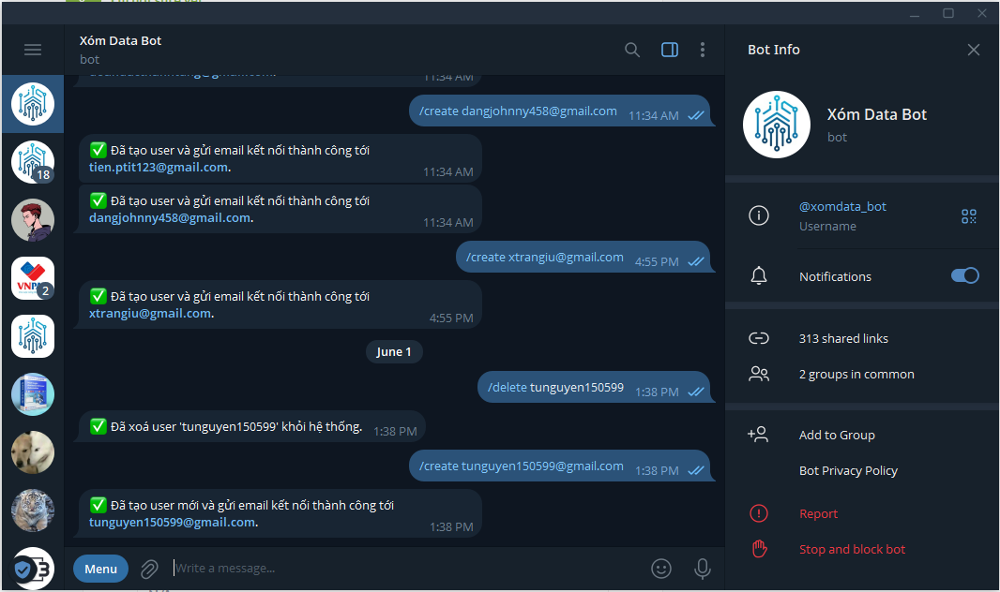

# 📊 Metabase Self-Learning Project

This repository documents my journey in exploring **Metabase**, an open-source business intelligence and analytics platform. The project includes:

- Connecting Metabase to a SQL Server instance (Xóm Data)
- Role-based access control via Telegram Bot
- Automatic report distribution via email
- Embedding dashboards into a local Node.js web app

---

## 🔧 Project Setup

### Prerequisites

- Docker installed and running
- SQL Server instance accessible
- Node.js and npm installed (for embedding)

### 🐳 Installing Metabase with Docker

```bash
docker run -d -p 3000:3000 --name metabase metabase/metabase
```

---

## 🖼️ Step-by-step Setup Guide

1. **Requesting an account via Telegram Bot**  
     
   > A custom Telegram Bot is used to generate an account creation request.

2. **Receiving account credentials via Gmail**  
     
   > The system sends login credentials to the user's email after approval.

3. **Connecting to SQL Server from Metabase**  
     
   > Use the credentials to log into Metabase and connect to the SQL Server database.

4. **Metabase Home View**  
     
   > After logging in, this is the main landing interface where you can access databases, dashboards, and queries.

5. **X-Ray View Feature**  
     
   > Quickly generate summaries and insights from tables using the powerful X-Ray feature.

6. **Creating SQL Parameters**  
     
   > You can parameterize SQL queries to enable dynamic filtering in dashboards.

7. **Using SQL Snippets**  
     
   > Easily reuse code blocks and query templates with snippets support.

8. **Building a Sample Dashboard**  
     
   > Create your first dashboard by combining charts, filters, and saved questions.

---

## 📬 Integration with Telegram & Email

- Use Telegram Bot to manage user permissions and broadcast report links.
- Configure alerts and automated report delivery via email from Metabase.

---

## 🌐 Embedding Dashboards with Node.js

You can embed dashboards securely into a local web server using **Node.js** and Metabase embedding tokens.

### 🖥️ Install Node.js on Ubuntu:

```bash
sudo apt update
sudo apt install nodejs
node -v
sudo apt install npm
```

### 🚀 Setup Static Web Server

```bash
cd path/of/project
mkdir local-web
cd local-web
npm init -y
npm install express
mkdir public
cd public
# Add your embed page and server file here (e.g., server.js)
node metabase-embed.js
```

### Embedding Flow:

9. **Setting Embed Options in Metabase**  
     
   > Configure embed settings (for static embedding in self-hosted setup).

10. **Running Local Node.js Server**  
     
   > Use Express to serve the embedded dashboard via a local web server.

11. **Final Embedded Result**  
     
   > The dashboard is now successfully embedded and viewable through your web page.

---

## 📁 Project Structure

```
metabase-self-learning/
├── images/
│   ├── s01_get_account.png
│   ├── s02_receive_account.png
│   ├── s03_import_connection.png
│   ├── s04_home_view.png
│   ├── s05_xray_view.png
│   ├── s06_sql_editor_with_parameters.png
│   ├── s07_sql_editor_with_snippets.png
│   ├── s08_quick_sample_dashboard.png
│   ├── s09_embed_options.png
│   ├── s10_running_nodejs.png
│   └── s11_embed_result.png
├── local-web/
│   └── public/
│       └── metabase-embed.js
├── docker-compose.yml
├── README.md
└── LICENSE
```

---

## 📚 Resources

- [Metabase Documentation](https://www.metabase.com/docs/)
- [Telegram Bot API](https://core.telegram.org/bots/api)
- [Express.js Guide](https://expressjs.com/)

---

## 📄 License

This project is licensed under the MIT License. See the [LICENSE](LICENSE) file for details.
